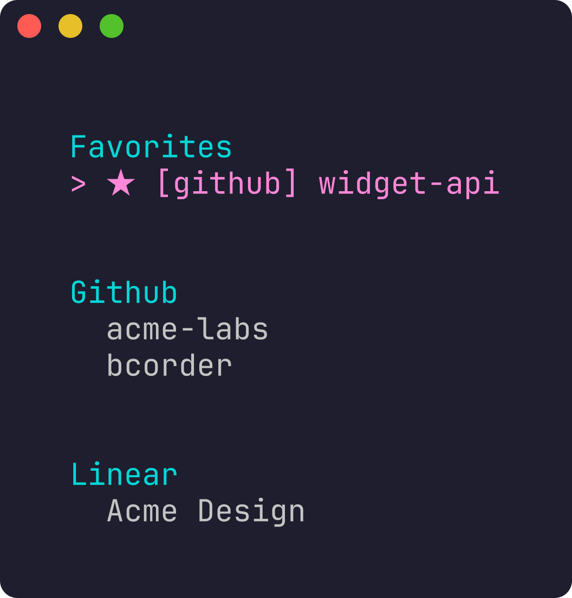
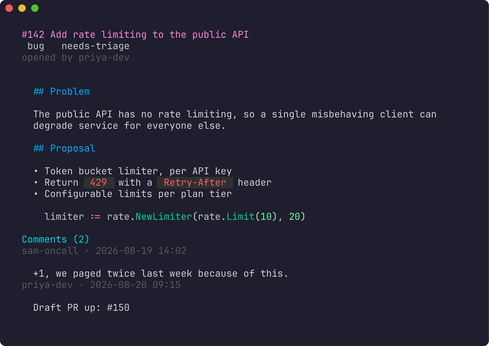
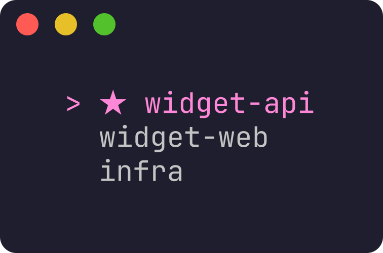
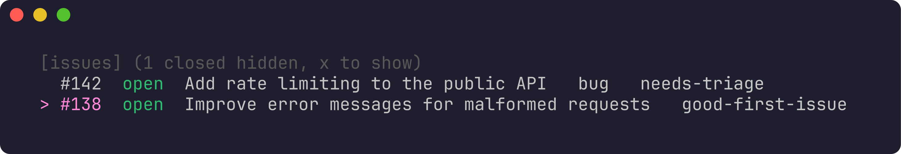
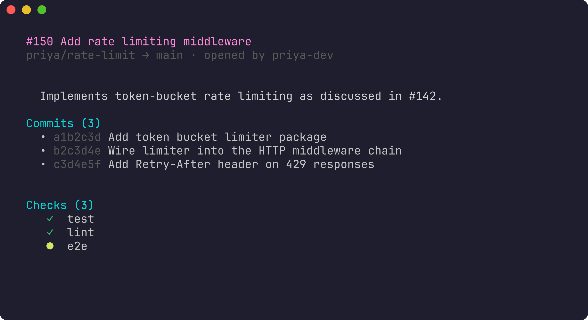

# chit

A TUI for browsing and acting on issues and pull requests across pluggable
providers, without leaving the terminal — GitHub (Issues + PRs) and Linear
(Issues) today, with room to add more.

<p align="center">
  
  
</p>

## Features

- **Browse** GitHub orgs/repos and Linear workspaces/teams in one grouped
  home screen, drilling down to issues and PRs
- **View** issue/PR detail with glamour-rendered markdown, badges, commit
  lists, and CI check status
- **Comment and reply** via `$EDITOR`, threaded on Linear and flat (quoted)
  on GitHub, matching what each provider actually supports
- **Approve, merge, and mark PRs ready for review**, with the repo's actual
  allowed merge methods and a confirmation step before anything real happens
- **Link hints** — a Vimium-style inline overlay for opening links and
  `#123`/`TEAM-456` cross-references without touching the mouse
- **Favorites** for one-keystroke navigation to the repos/teams you use most
- **Vim keybindings** throughout, with a local SQLite cache so navigation is
  instant on repeat visits — press `r` to force a refresh
- **Security**: GitHub auth is fully delegated to the `gh` CLI (chit never
  touches a GitHub token); Linear's API key lives in your OS's native secret
  store (Secret Service / Keychain / Credential Manager), never on disk in
  plaintext

<details>
<summary>More screenshots</summary>
<br>
<p align="center">
  
  
  
</p>
</details>

## Install

```sh
go install github.com/bjcorder/chit/cmd/chit@latest
```

Or build from a clone:

```sh
git clone https://github.com/bjcorder/chit.git
cd chit
go build -o chit ./cmd/chit
```

### Requirements

- Go 1.25+ (only if building from source)
- [`gh`](https://cli.github.com/), authenticated (`gh auth status`), for the
  GitHub provider — chit shells out to it for everything and never handles
  your GitHub token itself
- `$EDITOR` or `$VISUAL` set, for composing comments and replies (falls back
  to `vi`)

## Quick start

```sh
chit providers list                # see what's available and what's enabled
chit providers enable github       # gh already owns auth — nothing more to do
chit providers set-key linear      # prompts for a personal API key, hidden input
chit providers enable linear
chit                                # launch the TUI
```

Getting a Linear personal API key: **Linear → Settings → Account → Security
& access → Personal API keys → New API key**. It can be scoped to specific
teams and permissions if you'd rather not grant it full account access.

Press `?` inside the TUI at any time for the full keybinding reference.

## Configuration

chit follows the XDG base directory spec:

| What | Where (Linux) |
|---|---|
| Config (`config.toml`) | `~/.config/chit/config.toml` |
| Cache database | `~/.local/share/chit/chit.db` |
| Secret vault fallback (only used if no OS keyring is available) | `~/.local/share/chit/keyring/` |

`config.toml` is plain TOML and only ever needs hand-editing if you want to
skip the CLI helpers:

```toml
[providers.github]
enabled = true

[providers.linear]
enabled = true
```

No provider ever gets a config field for its credential — GitHub's token
lives wherever `gh` itself keeps it, and Linear's API key lives in your OS
keyring, set via `chit providers set-key linear`.

## Keybindings

**Everywhere:**

| Key | Action |
|---|---|
| `j` / `↓`, `k` / `↑` | move down / up |
| `enter` | open the selected item |
| `h` / `esc` / `backspace` | back |
| `q` / `ctrl+c` | back, or quit from the home screen |
| `f` | toggle favorite (on a container row) |
| `F` | jump straight to favorites, from any screen |
| `r` | refresh from the provider, bypassing the cache |
| `?` | toggle this help |

**On a repo/team's issue or PR list:**

| Key | Action |
|---|---|
| `p` | toggle between issues and PRs (GitHub only) |
| `x` | toggle showing closed issues / merged PRs (hidden by default) |

**On an issue or PR detail screen:**

| Key | Action |
|---|---|
| `c` | compose a new comment (`$EDITOR`) |
| `v` | pick a comment to reply to, then compose (`$EDITOR`) |
| `f` | show link hints — type a label to open it, any other key cancels |

**On a PR detail screen, additionally:**

| Key | Action |
|---|---|
| `a` | approve — `y` to confirm, `n` to cancel |
| `m` | propose/cycle the repo's allowed merge methods — `y` to confirm |
| `d` | mark a draft PR ready for review — `y` to confirm |

## Design

- **Providers** implement one or both of two capability interfaces —
  `IssueTracker` and `CodeHost` (see `internal/provider`) — and register
  themselves at compile time via `init()`. Which registered providers
  actually run is decided at runtime by `config.toml`, so adding a new
  provider never means recompiling with a different set of imports for the
  ones you don't use.
- **GitHub** integration (`internal/provider/github`) shells out to the `gh`
  CLI via argv only, never a shell — no injection risk regardless of what a
  comment body or issue title contains.
- **Linear** integration (`internal/provider/linear`) is a small hand-rolled
  GraphQL client (no official or well-maintained Go SDK exists) using a
  personal API key.
- **Domain model** (`internal/domain`) normalizes both providers' data into
  a small set of types — `Issue`, `PullRequest`, `Comment`, and a flat
  `Badge{Label, Color}` list — so the UI layer never special-cases a
  provider.
- **Cache** (`internal/cache`, SQLite via a pure-Go driver — no cgo) makes
  navigation instant on repeat visits. It's a cache, not a source of truth:
  every entry can be safely dropped and re-fetched, and a
  `cache_entries`-wiping version check guards against silently serving a
  stale shape after a cached type's fields change.
- **TUI** (`internal/tui`, [Bubble Tea](https://github.com/charmbracelet/bubbletea))
  is a stack of screens — home → children → items → detail — coordinated
  through push/pop messages, so no screen needs to know about the
  navigation stack itself.

## Development

```sh
go build ./...
go test ./... -race -cover
go vet ./...
```

CI runs `go vet`, tests, [`golangci-lint`](https://golangci-lint.run/),
[`govulncheck`](https://go.dev/blog/vuln), and
[`gosec`](https://github.com/securego/gosec) on every push and PR;
`main` is protected and requires all four to pass.

## License

[MIT](LICENSE)
